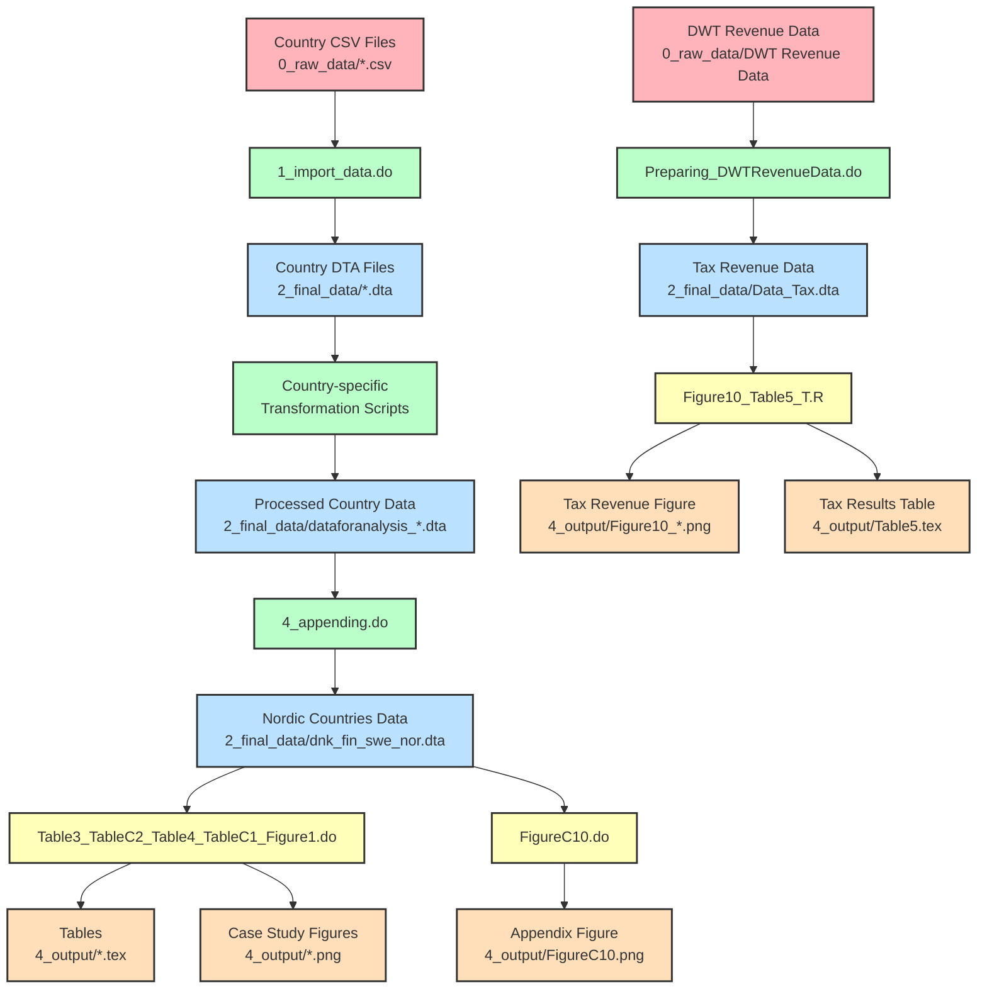

# Data Flow Architecture

This document provides a detailed view of how data flows through the replication package.

## Overview Diagram

## Detailed Data Flow

### 1. Raw Data Input

- **Country CSV Files** (`0_raw_data/*.csv`):
  - Proprietary data from Compustat and Markit
  - One file per country (e.g., `dnk.csv`, `swe.csv`)
  - Contains stock prices, volumes, lending data, etc.

- **DWT Revenue Data** (`0_raw_data/DWT Revenue Data/`):
  - `DWT_Revenues_Overview_Sept2022.xlsx`: Tax revenue data
  - `ExchangeRates_WB_clean.xlsx`: Exchange rate data

### 2. Data Transformation

- **Country Data Import** (`1_import_data.do`):
  - Imports CSV files and saves as Stata files (`2_final_data/*.dta`)

- **Country-specific Transformation**:
  - For each country, runs:
    - `frag_data_prep_1.do`
    - `frag_[country]_stock_exchange_selection.do`
    - `frag_data_prep_2.do`
    - `frag_[country]_exchange_rate_conversion.do`
    - `frag_data_prep_3.do`
  - Creates processed country data files (`2_final_data/dataforanalysis_*.dta`)

- **Data Appending** (`4_appending.do`):
  - Combines Nordic countries' data
  - Creates `2_final_data/dnk_fin_swe_nor.dta`

- **Tax Data Preparation** (`Preparing_DWTRevenueData.do`):
  - Processes DWT revenue data
  - Creates `2_final_data/Data_Tax.dta`

### 3. Analysis and Output Generation

- **Main Tables and Figures** (`Table3_TableC2_Table4_TableC1_Figure1.do`):
  - Analyzes `dnk_fin_swe_nor.dta`
  - Generates:
    - `4_output/Table3_sumstats.tex`
    - `4_output/TableC2_*.tex`
    - `4_output/Table4_*.tex`
    - `4_output/Novo_Nordisk.png`
    - `4_output/Svenska_Handelsbanken.png`

- **Tax Revenue Analysis** (`Figure10_Table5_T.R`):
  - Analyzes `Data_Tax.dta`
  - Generates:
    - `4_output/Figure10_synthDiD_NetDWT_Revenue_data_sept22.png`
    - `4_output/Table5.tex`

- **Appendix Figure** (`FigureC10.do`):
  - Analyzes `dnk_fin_swe_nor.dta`
  - Generates `4_output/FigureC10.png`

## Data Dependencies

- `Table3_TableC2_Table4_TableC1_Figure1.do` depends on `dnk_fin_swe_nor.dta`
- `Figure10_Table5_T.R` depends on `Data_Tax.dta`
- `FigureC10.do` depends on `dnk_fin_swe_nor.dta`