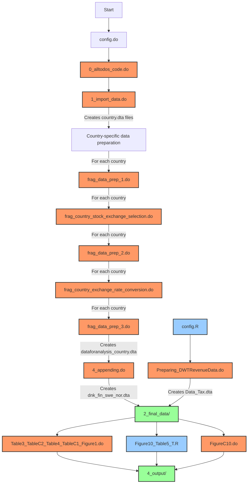

# Script Dependencies

This document outlines the dependencies between scripts in the replication package for "The Big Short (Interest): Closing the Loopholes in the Dividend-Withholding Tax".

## Overall Workflow

```
1. Data Import → 2. Data Transformation → 3. Data Analysis → 4. Output Generation
```

## Detailed Script Dependencies



## Script Execution Order

1. **Configuration**
   - `1_transformation_code/config.do` (Stata)
   - `3_analysis_code/config.R` (R)

2. **Data Import and Transformation**
   - `1_transformation_code/0_alltodos_code.do` (Stata)
     - Calls `1_import_data.do`
     - For each country, runs:
       - `frag_data_prep_1.do`
       - `frag_[country]_stock_exchange_selection.do`
       - `frag_data_prep_2.do`
       - `frag_[country]_exchange_rate_conversion.do`
       - `frag_data_prep_3.do`
     - Calls `4_appending.do`

3. **Tax Data Preparation**
   - `3_analysis_code/Preparing_DWTRevenueData.do` (Stata)

4. **Analysis and Output Generation**
   - `3_analysis_code/Table3_TableC2_Table4_TableC1_Figure1.do` (Stata)
   - `3_analysis_code/Figure10_Table5_T.R` (R)
   - `3_analysis_code/FigureC10.do` (Stata)

## Data Flow

1. **Raw Data Sources**
   - Country-specific CSV files from Compustat and Markit (`0_raw_data/*.csv`)
   - Dividend withholding tax revenue data (`0_raw_data/DWT Revenue Data/*.xlsx`)
   - Exchange rate data (`0_raw_data/DWT Revenue Data/ExchangeRates_WB_clean.xlsx`)

2. **Intermediate Data**
   - Country-specific Stata data files (`2_final_data/*.dta`)
   - Combined Nordic countries data (`2_final_data/dnk_fin_swe_nor.dta`)
   - Tax revenue data (`2_final_data/Data_Tax.dta`)

3. **Output Files**
   - Tables (LaTeX format, `4_output/*.tex`)
   - Figures (PNG format, `4_output/*.png`)